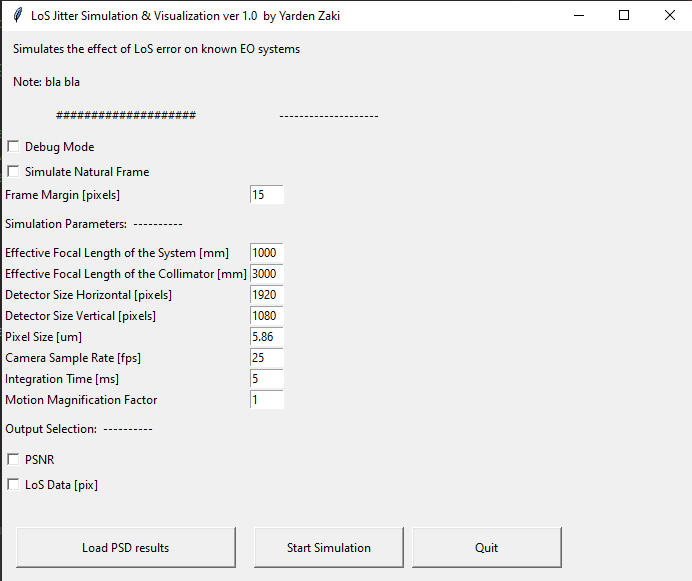
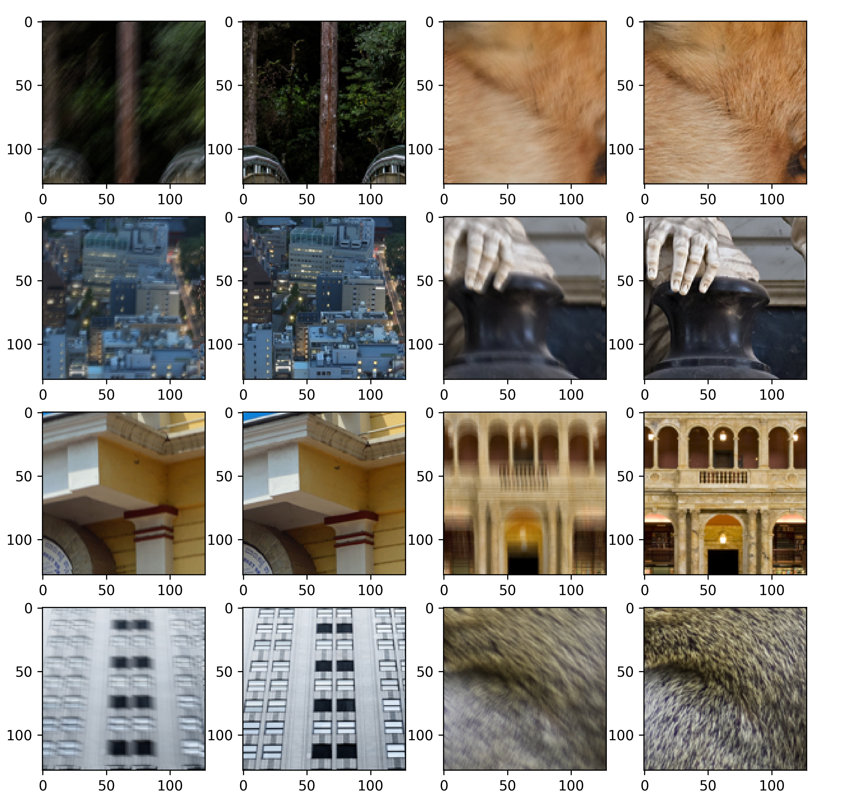

# Simulate-motion-blur-GUI
 Creating a simulation video from frame and LoS error analysis results

The desired ROI will vibrate according to the LoS error and statistical analysis
The analysis neglect any high - order image artifacts (defocus,astigmatism,coma etc..) and simulates only rigid body tilts ( first order Zernike polynoms)
How does it work?
1. Getting tilts LoS PSD Data [rad^2/Hz vs. Hz].
2. Converting to displacements LoS PSD with w.r.t the detector plane by multiplying with the (focal len)^2
3. Converting it to time history equivalent tilts [rad vs. time].
4. Render the corresponding image motion based on the results.

The results is a video with the simulated motion blur.

** V01 - 06/07/22 What's new?

1. Algorithm improvement: Sampling first DX , DY in "exposure time" based on CDF matching and not in a pure random - leads to non-zero correlation between DX , DY
2. Post Processing: Making animation of PDF , CDF plots of DX,DY for the 50 first frames.

